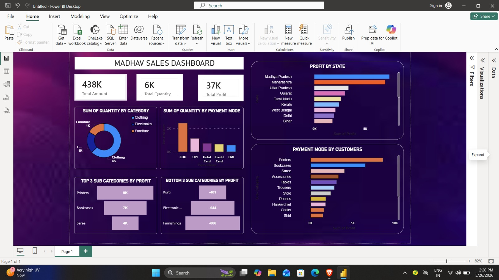

# Madhav Store Power BI Dashboard

## Project Overview

This project is an interactive Power BI dashboard created to analyze sales performance, customer behavior, payment methods, and profit trends for Madhav Store.

The dashboard provides useful business insights through interactive visualizations and KPIs.

---

## Dashboard Preview

---

## Key Metrics

- Total Sales Amount: 438K
- Total Quantity Sold: 6K
- Total Profit: 37K

---

## Features

### Sales Analysis
- Track total sales and quantity sold
- Analyze overall business performance

### Profit Analysis
- State-wise profit comparison
- Top and bottom performing sub-categories

### Customer Insights
- Payment mode analysis
- Customer purchasing behavior

### Category Analysis
- Quantity sold by category
- Product performance visualization

---

## Tools & Technologies Used

- Power BI
- Data Visualization
- CSV Dataset

---

## Files Included

- `madhav-store-dashboard.pbix` → Power BI dashboard
- `Orders-madhav.csv` → Orders dataset
- `Details.csv` → Additional dataset
- `Dashboard-screenshot.jpeg` → Dashboard preview image

---

## Business Insights

- COD is the most preferred payment mode
- Clothing category contributes highest sales quantity
- Printers and Bookcases generate highest profits
- Furnishings and Electronic items show losses

---

## Author

Chetan Gupta
